# דוח פרויקט: מערכת ניהול מלון

## שער
**שמות המגישים:** נעמי איבגי, אור גלעד  
**המערכת:** מערכת לניהול בתי מלון (Hotel Management System) 
**היחידה הנבחרת:** ניהול חדרים  (Rooms Management) 

---
# שלב א'-
## תוכן עניינים
1. [מבוא ותיאור המערכת](#מבוא-ותיאור-המערכת)
2. [ממשק משתמש (AI Studio)](#ממשק-משתמש-ai-studio)
3. [מודל נתונים (ERD & DSD)](#מודל-נתונים-erd--dsd)
4. [החלטות עיצוב](#החלטות-עיצוב)
5. [שיטות הכנסת נתונים](#שיטות-הכנסת-נתונים)
6. [גיבוי ושחזור נתונים (Backup & Recovery)](#גיבוי-ושחזור-נתונים)

---

## מבוא ותיאור המערכת
מערכת **LuxStay OS** היא פלטפורמה לניהול תפעולי של בתי מלון, שנועדה לייעל את הקשר בין מצב החדרים הפיזי לבין הניהול הפיננסי והשירותי. המערכת שומרת ומנהלת נתונים קריטיים הכוללים סוגי חדרים, סטטוס זמינות בזמן אמת, עונות שנה מוגדרות מראש, ומבצעים דינמיים.

**הפונקציונליות העיקרית של המערכת:**
* **ניהול תחזוקה:** מעקב שוטף אחרי קריאות שירות ותיקונים לכל חדר (Maintenance logs). המערכת מאפשרת תיעוד תקלות, סיווגן לפי דחיפות ומעקב עד לביצוע התיקון.
* **מנגנון תמחור דינמי:** עדכון אוטומטי של מחירי חדרים בהתאם לעונה (Season) ולהטבות פעילות (Special Offers), מה שמאפשר מקסימום רווחיות בתקופות שיא.
* **ניהול שירותים נלווים:** התאמה אישית של שירותים (Amenities) לכל חדר, המאפשרת שקיפות מלאה מול הלקוח לגבי אבזור החדר ותמחורו.

מטרת המערכת היא לספק למנהלי המלון "לוח מחוונים" (Dashboard) מרכזי המאפשר שליטה מלאה על תפוסת המלון וניהול יעיל של משאבי התחזוקה.

---

## ממשק משתמש (AI Studio)
אבטיפוס המערכת עוצב ותוכנן באמצעות Google AI Studio כדי להמחיש את חוויית המשתמש הסופית ואת זרימת העבודה של מנהל המערכת. הממשק מדגים את ה-Dashboard המרכזי הכולל נתונים תפעוליים חיים, ניהול מחירונים ותחזוקה.

**לינק לצפייה באבטיפוס החי:** [לחצו כאן לצפייה בממשק ב-AI Studio](https://aistudio.google.com/app/prompts?state=%7B%22ids%22:%5B%221lZpjERihFWZ-ODl9xFFTwpuhAknqlan3%22%5D,%22action%22:%22open%22,%22userId%22:%22108644190604974326039%22,%22resourceKeys%22:%7B%7D%7D&usp=sharing)

### מסכי המערכת:

#### 1. מבט על תפעולי (Operations Overview)
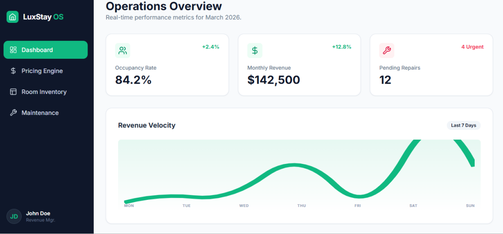
[cite_start]*תיאור: לוח מחוונים המציג אחוזי תפוסה, הכנסות וסטטוס תיקונים דחופים.* [cite: 133, 165]

#### 2. מנוע תמחור (Pricing Engine)
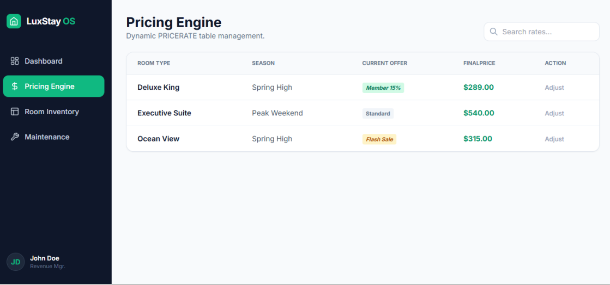
[cite_start]*תיאור: ממשק לניהול מחירי חדרים דינמיים בהתאם לעונות ומבצעים.* [cite: 133, 165]

#### 3. מלאי חדרים (Room Inventory)
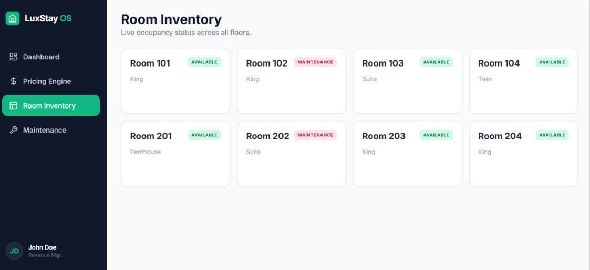
[cite_start]*תיאור: תצוגת מצב החדרים במלון וחלוקה לפי סוגי חדרים.* [cite: 133, 165]

#### 4. ניהול תחזוקה (Maintenance Management)
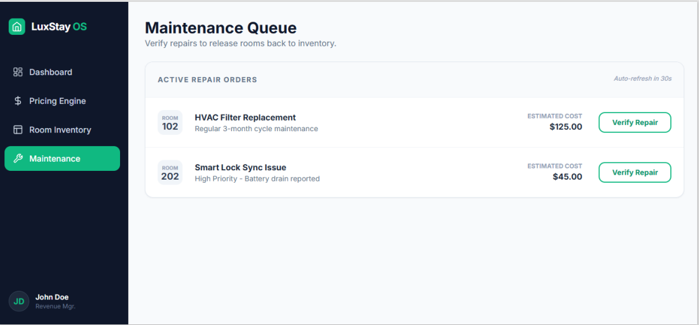
[cite_start]*תיאור: מערכת לניהול קריאות שירות, מעקב אחרי עבודות תחזוקה וסטטוס ביצוע.* [cite: 133, 165]

---
## מודל נתונים (ERD & DSD)
לאחר אפיון דרישות המערכת, תכננו את מבנה בסיס הנתונים בצורה שתבטיח שלמות נתונים (Data Integrity) ויעילות בשאילתות.

### תרשים ERD (Entity Relationship Diagram)
התרשים מציג את הישויות המרכזיות במערכת (חדרים, מחירונים, תחזוקה) ואת הקשרים הלוגיים ביניהן.
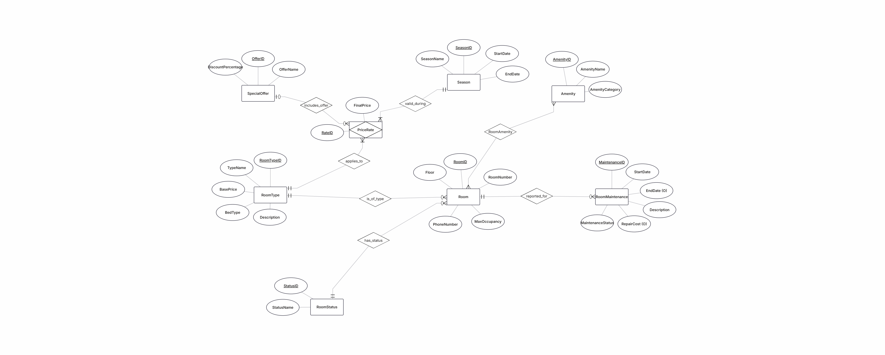

### תרשים DSD (Data Structure Diagram)
התרשים מציג את המבנה הפיזי של הטבלאות, כולל הגדרת סוגי נתונים, מפתחות ראשיים (PK) ומפתחות זרים (FK).
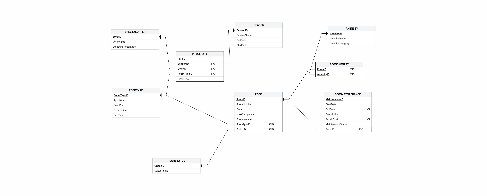

---

## החלטות עיצוב ונימוקים
בתהליך התכנון קיבלנו מספר החלטות עיצוביות מרכזיות כדי לשפר את ביצועי המערכת ואת יכולת התחזוקה שלה:

1. **הפרדת טבלת PriceRate:** בחרנו להפריד את מחירי החדרים לטבלה נפרדת המקושרת לעונות (Seasons).
   * **נימוק:** החלטה זו מאפשרת לשנות מחירי חדרים באופן גורף לפי תקופה מבלי לעדכן כל חדר בנפרד, ובכך נמנעת כפילות נתונים ונשמרת נורמליזציה של בסיס הנתונים.
2. **טבלת קשר RoomAmenity:** השירותים הנלווים מנוהלים בטבלת קשר (Many-to-Many).
   * **נימוק:** מבנה זה מאפשר גמישות מקסימלית בהוספת שירותים חדשים לחדרים קיימים או הסרתם מבלי לשנות את מבנה הטבלאות הראשיות.
3. **ניהול היסטוריית תחזוקה:** כל קריאת שירות נשמרת כרשומה נפרדת בטבלת `RoomMaintenance`.
   * **נימוק:** הפרדה זו מאפשרת להפיק דוחות סטטיסטיים על בלאי של חדרים לאורך זמן, לנהל עומסים של אנשי צוות ולעקוב אחרי היסטוריית התיקונים של כל חדר בנפרד.

---
##📥 שיטות אכלוס הנתונים (Data Ingestion Methods)

בהתאם לדרישות הפרויקט, בסיס הנתונים אוכלס באמצעות שלוש טכניקות משלימות, המדגימות שליטה במגוון שיטות להזנת נתונים למערכת:

### 1. הכנסת נתונים ידנית (Manual INSERT Commands)
* **תיאור:** הגדרת ישויות הליבה ותשתית המערכת (כגון סוגי חדרים, עונות, סטטוסים ומבצעים) בוצעה באמצעות פקודות `INSERT` מפורשות המבטיחות שליטה מלאה בנתוני הבסיס הראשוניים.
* **מיקום קבצים:** תיקיית `ManualInsert`.
* **דגש טכני:** בשיטה זו הוטמע גם **חישוב מחיר סופי דינמי** בטבלת `PRICERATE` באמצעות שאילתת `INSERT INTO ... SELECT`. השאילתה מחשבת את המחיר הסופי (`FinalPrice`) באופן אוטומטי על בסיס הצלבת נתונים (Cross Join) בין מחירי הבסיס, מקדמי העונה ואחוזי ההנחה.

### 2. שימוש בתכנות (Programming - Python Script)
* **תיאור:** לצורך יצירת "מסה" של נתונים (Big Data) ובדיקת ביצועי המערכת תחת עומס, נעזרנו בסקריפט פייתון (`generate_data.py`). הסקריפט מייצר אלפי שורות של מידע סינתטי אמין עבור טבלאות המלון.
* **מיקום קבצים:** תיקיית `Programing`.
* **קבצים כלולים:** * `generate_data.py`: קוד המקור המייצר את הנתונים.
    * `generated_insert_data.sql`: הפלט הסופי הכולל כ-20,000 פקודות הכנסה לטבלאות החדרים והתחזוקה.

### 3. ייבוא נתונים מקבצים חיצוניים (Data Import - CSV)
* **תיאור:** הדמיית ייבוא נתונים מתוך מערכות חיצוניות או קבצי אקסל (Legacy Data). שיטה זו שימשה להזנת רשימות ציוד ומתקנים מפורטות.
* **מיקום קבצים:** תיקיית `DataImportFiles`.
* **קבצים כלולים:** * `amenities.csv`: קובץ הנתונים הגולמי.
    * `import_amenities.sql`: סקריפט הייבוא המשתמש בפקודת `COPY` של PostgreSQL להזרמת הנתונים ישירות מהקובץ לטבלה.

---

## גיבוי נתונים ושחזורם
כחלק מדרישות המערכת ועל מנת להבטיח את שרידות הנתונים, ביצענו תהליך מלא של גיבוי ואימות שחזור (Backup & Recovery).

### 1. ביצוע הגיבוי
הגיבוי בוצע בשני ערוצים כדי להבטיח זמינות:
* **גיבוי גרפי (UI):** שימוש בכלי ה-Backup של pgAdmin ליצירת קובץ SQL.
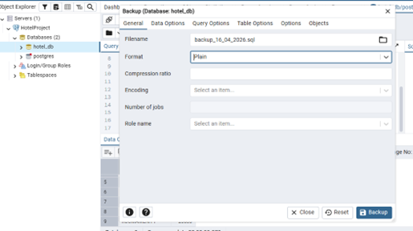

* **גיבוי טרמינל (CLI):** שימוש בפקודת `pg_dump` בתוך סביבת ה-Docker ליצירת קובץ גיבוי פיזי בשם `backup_final.sql`.
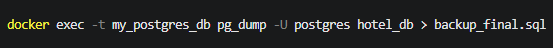

### 2. תהליך השחזור (Recovery Test)
כדי לוודא את תקינות הגיבוי והאפשרות לנייד אותו, ביצענו שחזור לתוך בסיס נתונים חדש וריק:

1. **יצירת Database חדש:** הקמנו בסיס נתונים בשם `hotel_test_restore`.
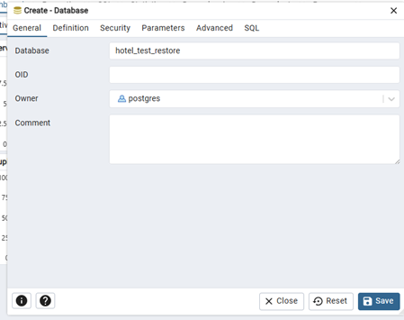

2. **ביצוע השחזור:** הזרקת הנתונים מקובץ הגיבוי באמצעות הטרמינל.
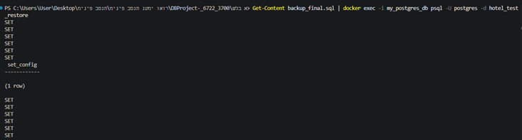
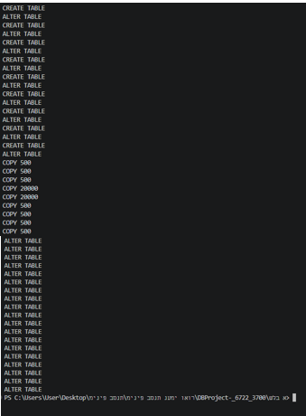

### 3. בדיקת תקינות ואימות נתונים (Validation)
לאחר השחזור, הרצנו שאילתת בדיקה (Count) על כלל הטבלאות בבסיס הנתונים החדש כדי לוודא שכל המידע עבר בצורה מלאה.
* **תוצאות הבדיקה:** ניתן לראות כי כל 20,000 הרשומות בטבלת התחזוקה (RoomMaintenance) ובשאר הטבלאות עברו בהצלחה.
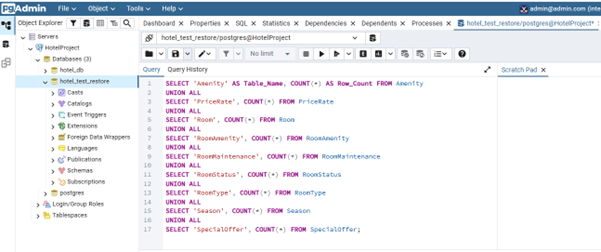
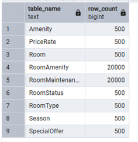

---

# שלב ב' - שאילתות, אילוצים וייעול המערכת

## תוכן עניינים - 
* [הקדמה](#הקדמה)
* [1. שאילתות שליפה (SELECT Queries)](#1-שאילתות-שליפה-select-queries)
* [2. שאילתות מחיקה (DELETE)](#2-שאילתות-מחיקה-delete)
* [3. שאילתות עדכון (UPDATE)](#3-שאילתות-עדכון-update)
* [4. טרנזקציות (Rollback & Commit)](#4-טרנזקציות-rollback--commit)
* [5. הוספת אילוצים (Constraints)](#5-הוספת-אילוצים-constraints)
* [6. אינדקסים וייעול המערכת (Indexes)](#6-אינדקסים-וייעול-המערכת-indexes)

---

## הקדמה
בשלב זה של הפרויקט ביצענו תשאול מעמיק של בסיס הנתונים באמצעות שאילתות מורכבות. בחלק מהמקרים, בעקבות כתיבת השאילתות, ביצענו שינויים בטבלאות באמצעות פקודות `ALTER TABLE`. השאילתות הותאמו למסכים שאופיינו בשלב א' מתוך מחשבה על תצוגת הנתונים ב-GUI של המערכת הסופית. 
בנוסף, הוספנו אילוצים (Constraints) לשמירה על אמינות הנתונים, וביצענו אופטימיזציה לזמני הריצה באמצעות יצירת אינדקסים, תוך השוואת זמני הריצה לפני ואחרי. (קוד השאילתות המלא נמצא בקבצי ה-SQL המצורפים להגשה).

---

## 1. שאילתות שליפה (SELECT Queries)

### 1.1 שאילתות כפולות (השוואת יעילות)
עבור 4 השאילתות הבאות נכתבו שתי גרסאות שונות המשיגות את אותה התוצאה, על מנת לנתח ולהשוות את יעילותן (למשל שימוש ב-JOIN לעומת Subqueries).

**שאילתא 1: [תאר את השאילתא בעברית - מה היא שולפת ומאיזה טבלאות]**
* **הסבר על ההבדל ביעילות:** [הסבר איזו צורה יעילה יותר ומדוע]
* **צורה 1:** 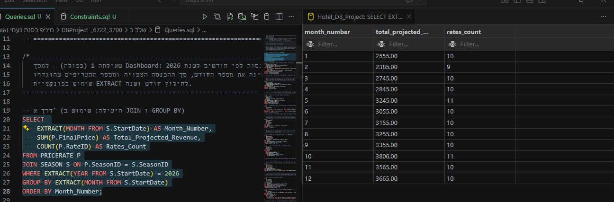
* **צורה 2:** 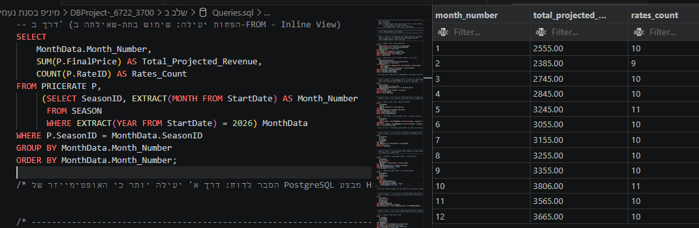

**שאילתא 2: [תאר את השאילתא בעברית]**
* **הסבר על ההבדל ביעילות:** [הסבר איזו צורה יעילה יותר ומדוע]
* **צורה 1:** 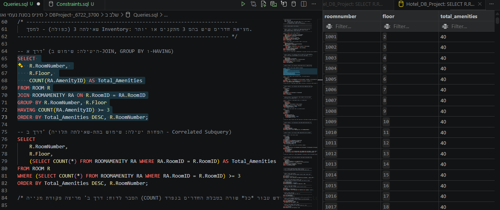
* **צורה 2:** 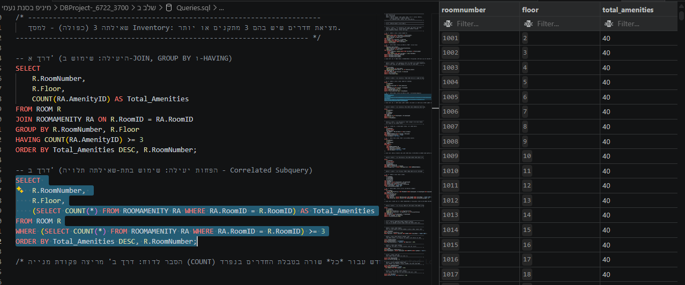

**שאילתא 3: [תאר את השאילתא בעברית]**
* **הסבר על ההבדל ביעילות:** [הסבר איזו צורה יעילה יותר ומדוע]
* **צורה 1:** 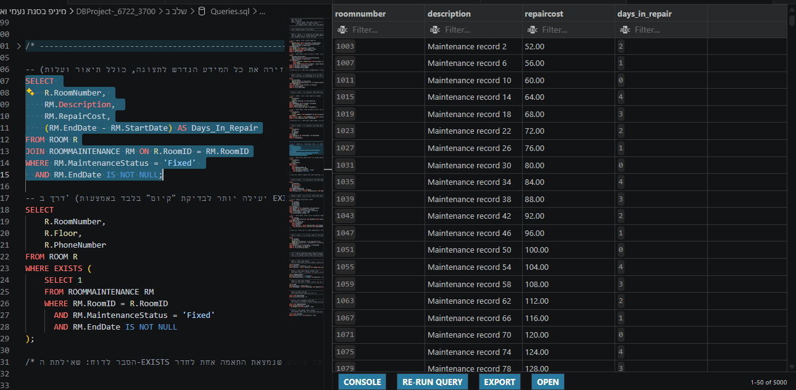
* **צורה 2:** 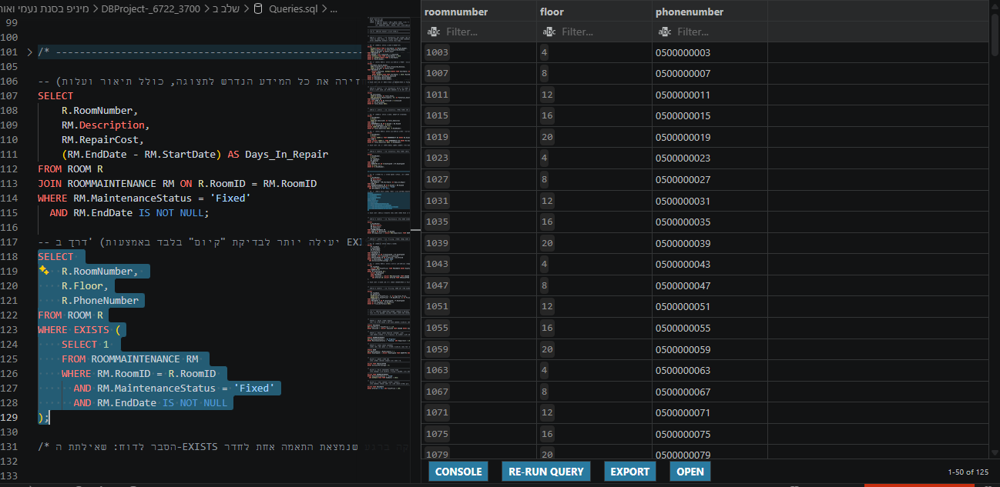

**שאילתא 4 (כוללת שימוש בשדות תאריכים): [תאר את השאילתא בעברית והסבר כיצד פירקת את התאריך]**
* **הסבר על ההבדל ביעילות:** [הסבר איזו צורה יעילה יותר ומדוע]
* **צורה 1:** 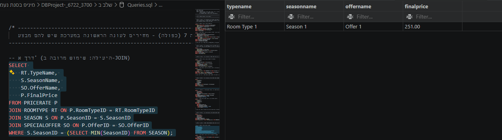
* **צורה 2:** 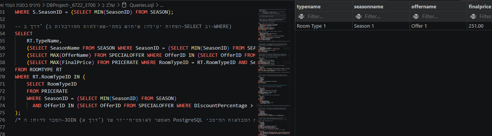

### 1.2 שאילתות שליפה רגילות נוספות

**שאילתא 5: [תיאור מילולי של השאילתא בעברית]**
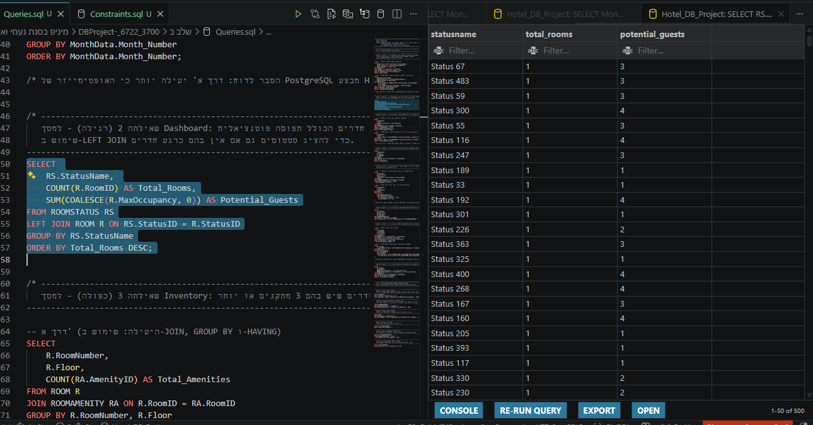

**שאילתא 6: [תיאור מילולי של השאילתא בעברית]**
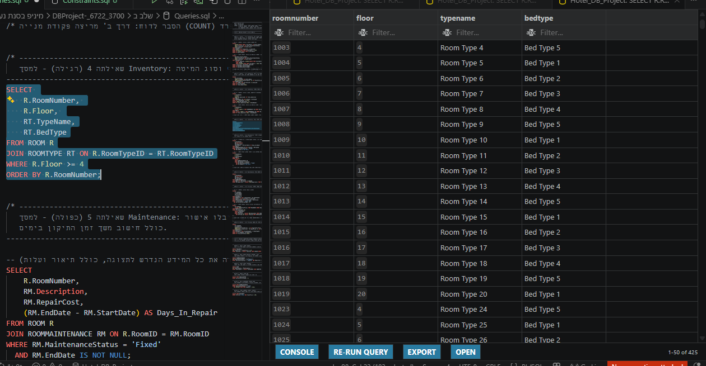

**שאילתא 7: [תיאור מילולי של השאילתא בעברית]**
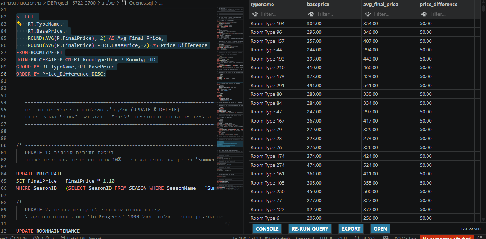

**שאילתא 8: [תיאור מילולי של השאילתא בעברית]**

---

## 2. שאילתות מחיקה (DELETE)

**שאילתא 1: [תיאור מילולי בעברית - מה נמחק ומדוע]**
* **בסיס הנתונים לפני המחיקה:** 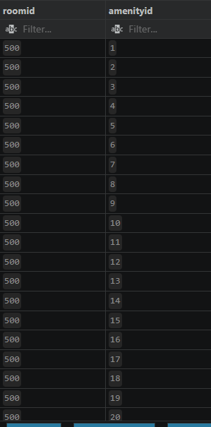
* **בסיס הנתונים אחרי המחיקה:** 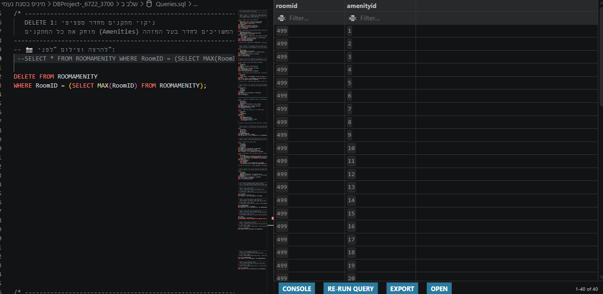

**שאילתא 2: [תיאור מילולי בעברית]**
* **בסיס הנתונים לפני המחיקה:** 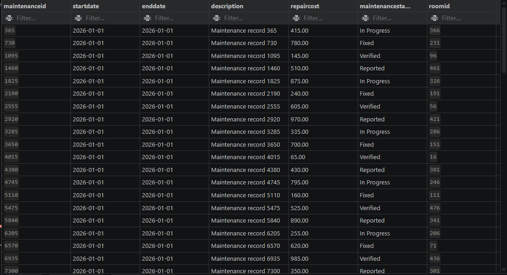
* **בסיס הנתונים אחרי המחיקה:** 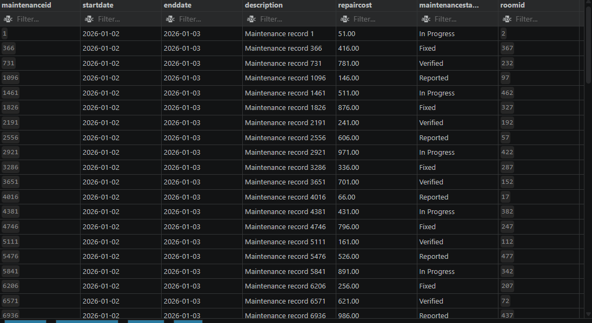

**שאילתא 3: [תיאור מילולי בעברית]**
* **בסיס הנתונים לפני המחיקה:** 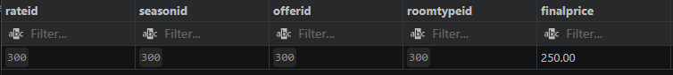
* **בסיס הנתונים אחרי המחיקה:** 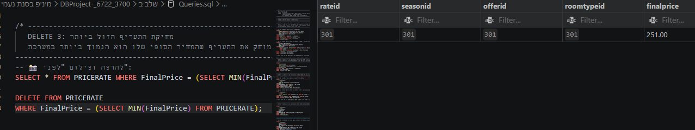

---

## 3. שאילתות עדכון (UPDATE)

**שאילתא 1: [תיאור מילולי בעברית - מה עודכן ומדוע]**
* **בסיס הנתונים לפני העדכון:** 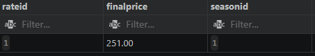
* **בסיס הנתונים אחרי העדכון:** 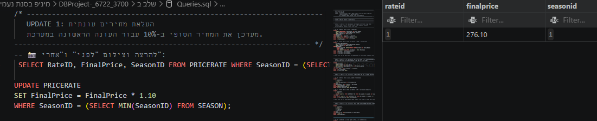

**שאילתא 2: [תיאור מילולי בעברית]**
* **בסיס הנתונים לפני העדכון:** 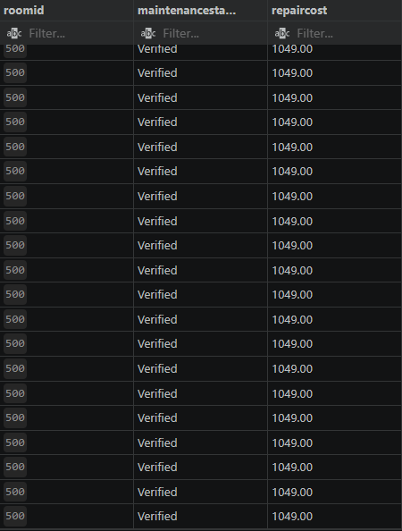
* **בסיס הנתונים אחרי העדכון:** 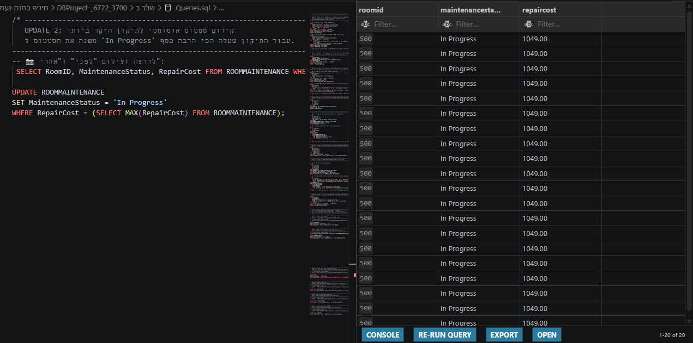

**שאילתא 3: [תיאור מילולי בעברית]**
* **בסיס הנתונים לפני העדכון:** 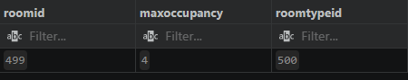
* **בסיס הנתונים אחרי העדכון:** 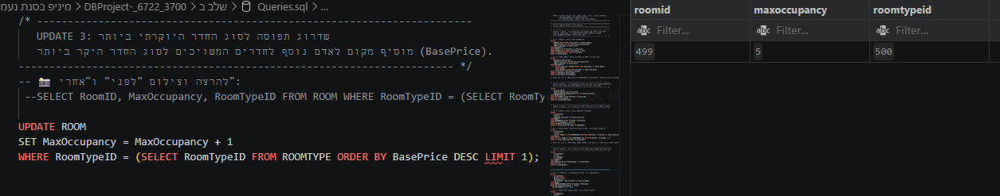

---

## 4. טרנזקציות (Rollback & Commit)

### 4.1 ביצוע Rollback (ביטול עדכון)
ביצענו עדכון בבסיס הנתונים, הראינו את המצב לאחר העדכון, ולאחר מכן ביצענו פקודת `ROLLBACK` כדי להראות שבסיס הנתונים חזר לקדמותו.
1. **מצב בסיס הנתונים ההתחלתי:** 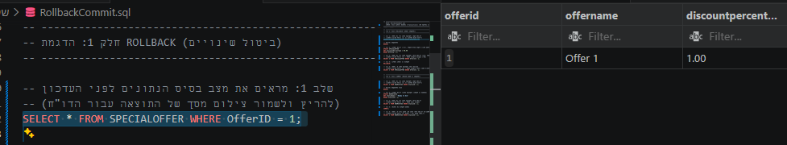
2. **מצב בסיס הנתונים לאחר העדכון (לפני ה-Rollback):** 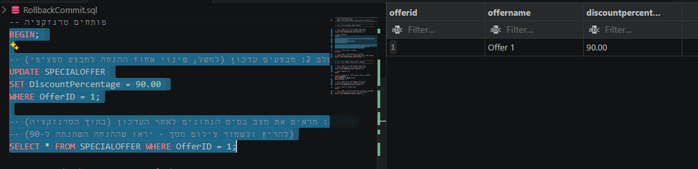
3. **מצב בסיס הנתונים לאחר פקודת ה-Rollback (חזרה למקור):** 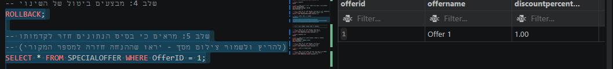

### 4.2 ביצוע Commit (שמירת עדכון)
ביצענו עדכון בבסיס הנתונים ולאחר מכן אישרנו אותו סופית באמצעות פקודת `COMMIT`, כך שהמצב נשאר מעודכן.
1. **מצב בסיס הנתונים ההתחלתי:** 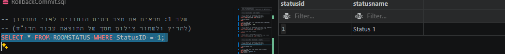
2. **מצב בסיס הנתונים לאחר העדכון:** 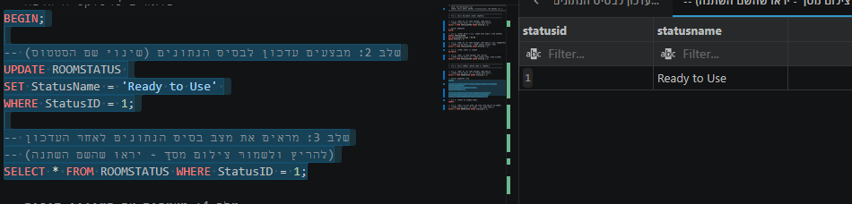
3. **מצב בסיס הנתונים לאחר ה-Commit (השינוי נשמר):** 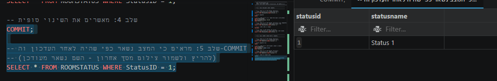

---

## 5. הוספת אילוצים (Constraints)

**דו"ח מוטיבציה ותועלת:** כדי למנוע הכנסת נתונים שגויים שעלולים לפגוע בלוגיקה של המערכת (למשל מחיר שלילי או תאריך סיום שקודם לתאריך התחלה), הוספנו 3 אילוצים חדשים לטבלאות הקיימות.

**אילוץ 1: [תאר את האילוץ בעברית]**
* **תיאור השינוי (`ALTER TABLE`):** [הסבר מה הפקודה שבוצעה עושה]
* **בדיקת האילוץ (שגיאה עקב ניסיון להכניס נתון סותר):** 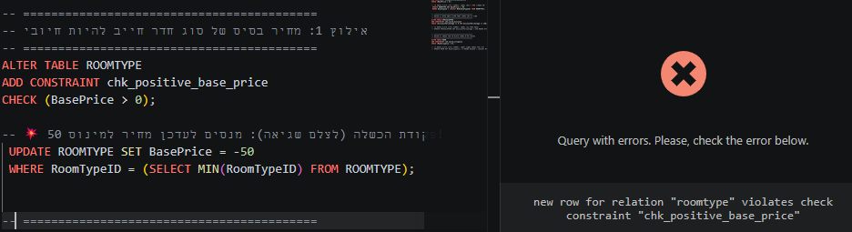

**אילוץ 2: [תאר את האילוץ בעברית]**
* **תיאור השינוי (`ALTER TABLE`):** [הסבר מה הפקודה שבוצעה עושה]
* **בדיקת האילוץ (שגיאה עקב ניסיון להכניס נתון סותר):** 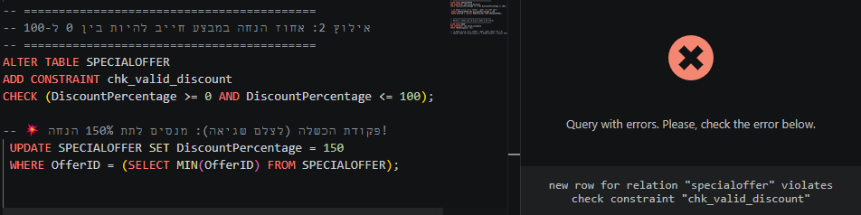

**אילוץ 3: [תאר את האילוץ בעברית]**
* **תיאור השינוי (`ALTER TABLE`):** [הסבר מה הפקודה שבוצעה עושה]
* **בדיקת האילוץ (שגיאה עקב ניסיון להכניס נתון סותר):** 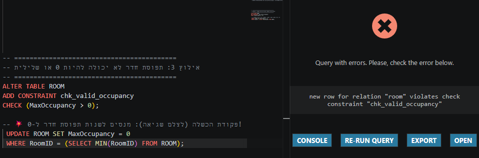

---

## 6. אינדקסים וייעול המערכת (Indexes)

**דו"ח מוטיבציה ותועלת:** במטרה לייעל את זמן הריצה של השאילתות ולמנוע סריקה מלאה של הטבלה (Full Table Scan), במיוחד בטבלאות גדולות וכבדות, יצרנו 3 אינדקסים על עמודות המשמשות לחיפוש וסינון תדיר.

**אינדקס 1: [תאר על איזו עמודה ואיזו טבלה הופעל האינדקס]**
* **זמן הריצה של שאילתא *לפני* הוספת האינדקס:** 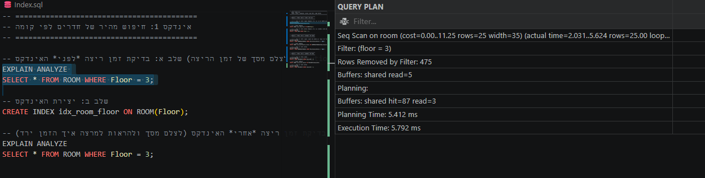
* **זמן הריצה של אותה שאילתא *אחרי* הוספת האינדקס:** 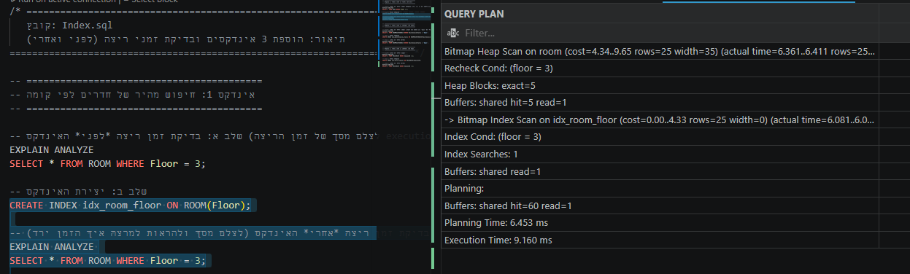
* **הסבר התוצאות:** [הסבר כאן בכמה מילישניות הצטמצם זמן הריצה ומדוע]

**אינדקס 2: [תאר על איזו עמודה ואיזו טבלה הופעל האינדקס]**
* **זמן הריצה *לפני* הוספת האינדקס:** 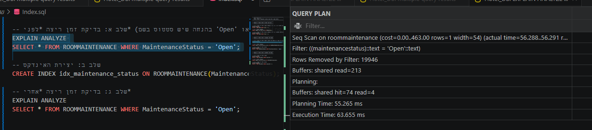
* **זמן הריצה *אחרי* הוספת האינדקס:** 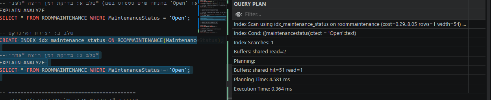
* **הסבר התוצאות:** [הסבר את השיפור בזמנים]

**אינדקס 3: [תאר על איזו עמודה ואיזו טבלה הופעל האינדקס]**
* **זמן הריצה *לפני* הוספת האינדקס:** 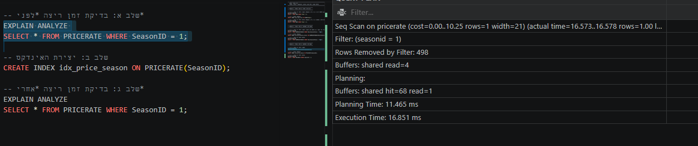
* **זמן הריצה *אחרי* הוספת האינדקס:** 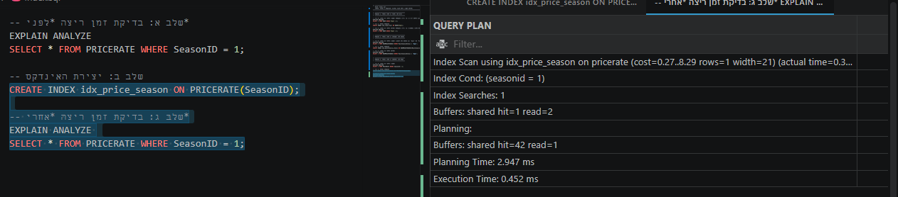
* **הסבר התוצאות:** [הסבר את השיפור בזמנים]
