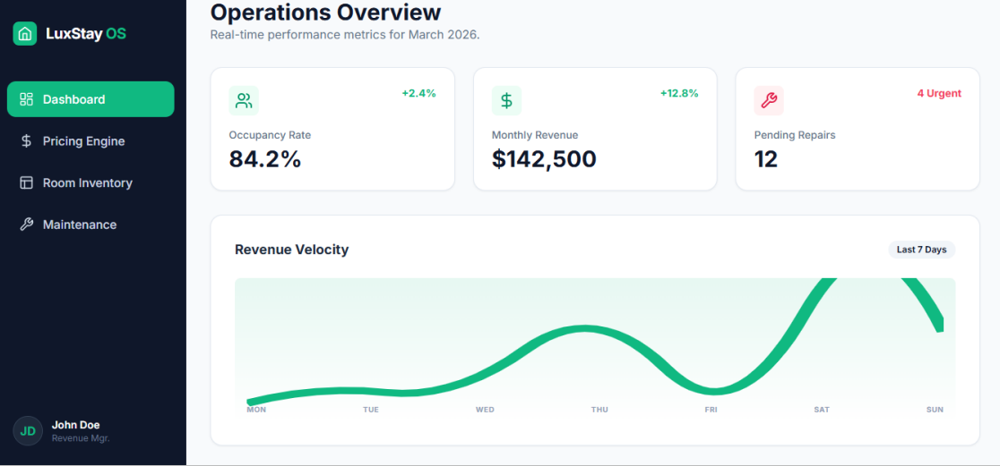
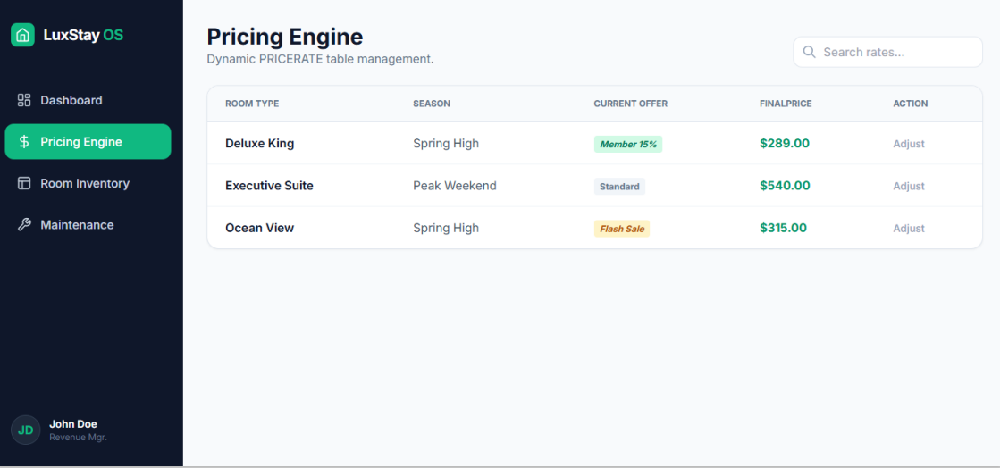
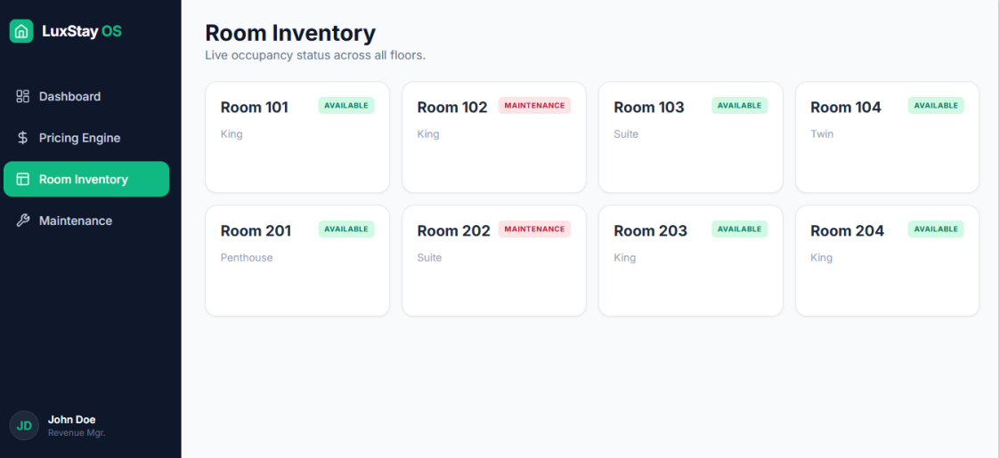
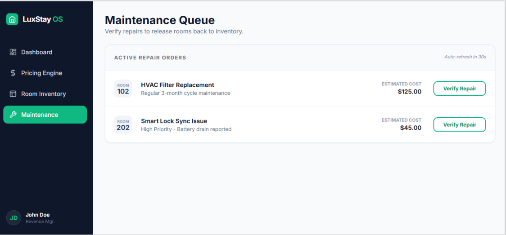

# DBProject-_6722_3700
# דוח פרויקט: מערכת ניהול מלון - שלב א'

## שער
**שמות המגישים:** נעמי איבגי, אור גלעד  
**המערכת:** מערכת לניהול בתי מלון (Hotel Management System) 
**היחידה הנבחרת:** ניהול חדרים  (Rooms Management) 

---

## תוכן עניינים
1. [מבוא ותיאור המערכת](#מבוא-ותיאור-המערכת)
2. [ממשק משתמש (AI Studio)](#ממשק-משתמש-ai-studio)
3. [מודל נתונים (ERD & DSD)](#מודל-נתונים-erd--dsd)
4. [החלטות עיצוב](#החלטות-עיצוב)
5. [שיטות הכנסת נתונים](#שיטות-הכנסת-נתונים)
6. [גיבוי ושחזור נתונים (Backup & Recovery)](#גיבוי-ושחזור-נתונים)

---

## מבוא ותיאור המערכת
מערכת **LuxStay OS** היא פלטפורמה לניהול תפעולי של בתי מלון, שנועדה לייעל את הקשר בין מצב החדרים הפיזי לבין הניהול הפיננסי והשירותי. המערכת שומרת ומנהלת נתונים קריטיים הכוללים סוגי חדרים, סטטוס זמינות בזמן אמת, עונות שנה מוגדרות מראש, ומבצעים דינמיים.

**הפונקציונליות העיקרית של המערכת:**
* **ניהול תחזוקה:** מעקב שוטף אחרי קריאות שירות ותיקונים לכל חדר (Maintenance logs). המערכת מאפשרת תיעוד תקלות, סיווגן לפי דחיפות ומעקב עד לביצוע התיקון.
* **מנגנון תמחור דינמי:** עדכון אוטומטי של מחירי חדרים בהתאם לעונה (Season) ולהטבות פעילות (Special Offers), מה שמאפשר מקסימום רווחיות בתקופות שיא.
* **ניהול שירותים נלווים:** התאמה אישית של שירותים (Amenities) לכל חדר, המאפשרת שקיפות מלאה מול הלקוח לגבי אבזור החדר ותמחורו.

מטרת המערכת היא לספק למנהלי המלון "לוח מחוונים" (Dashboard) מרכזי המאפשר שליטה מלאה על תפוסת המלון וניהול יעיל של משאבי התחזוקה.

---

## ממשק משתמש (AI Studio)
אבטיפוס המערכת עוצב ותוכנן באמצעות Google AI Studio כדי להמחיש את חוויית המשתמש הסופית ואת זרימת העבודה של מנהל המערכת. הממשק מדגים את ה-Dashboard המרכזי הכולל נתונים תפעוליים חיים, ניהול מחירונים ותחזוקה.

**לינק לצפייה באבטיפוס החי:** [לחצו כאן לצפייה בממשק ב-AI Studio](https://aistudio.google.com/app/prompts?state=%7B%22ids%22:%5B%221lZpjERihFWZ-ODl9xFFTwpuhAknqlan3%22%5D,%22action%22:%22open%22,%22userId%22:%22108644190604974326039%22,%22resourceKeys%22:%7B%7D%7D&usp=sharing)

### מסכי המערכת:

#### 1. מבט על תפעולי (Operations Overview)

*תיאור: לוח מחוונים המציג אחוזי תפוסה, הכנסות וסטטוס תיקונים דחופים.*

#### 2. מנוע תמחור (Pricing Engine)

*תיאור: ממשק לניהול מחירי חדרים דינמיים בהתאם לעונות ומבצעים.*

#### 3. מלאי חדרים (Room Inventory)

*תיאור: תצוגת מצב החדרים במלון וחלוקה לפי סוגי חדרים.*

#### 4. ניהול תחזוקה (Maintenance Management)

*תיאור: מערכת לניהול קריאות שירות, מעקב אחרי עבודות תחזוקה וסטטוס ביצוע.*

---

